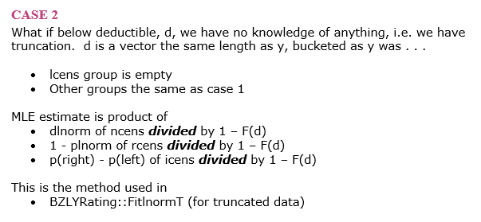

```{r setup, eval=TRUE, echo=FALSE, results='hide'}
source('../_common/common.R')
library(tidyverse)
library(ggplot2)
library(MASS)
library(actuar)
library(fitdistrplus)
```


## Sample Policies

```{r}
deductibles <- c(1e3, 5e3, 10e3)
limits <- c(100e3, 250e3, 500e3)
set.seed(0)
policy_ded <- sample(deductibles, 1e3, replace = TRUE, prob = c(5, 3, 1))
policy_lim <- sample(limits, 1e3, replace = TRUE, prob = c(5, 3, 1))
table(policy_ded, policy_lim)
```


## Real Loss Distribution

I want a loss distribution that is less than 1000 10% of the time
and over 500,000 2% of the time.


:::::::::::::: {.columns}
::: {.column}
```{r}
optim_res <- optim(
  par = c(9.0, 2.0), 
  fn = function(p) {
    (1e3 - qlnorm(0.1, p[1], p[2]))^2 + 
      (500e3 - qlnorm(0.98, p[1], p[2]))^2
  })
mu <- 9.30
sigma <- 1.86
qlnorm(c(0.1, 0.98), mu, sigma)
```
:::
::: {.column}
```{r echo=FALSE}
print(optim_res)
```
:::
::::::::::::::


## Simulate Losses

```{r fig.height=3, fig.width=7, fig.}
set.seed(-93)
ground_up <- rlnorm(1e3, mu, sigma)
```

:::::::::::::: {.columns}
::: {.column}
```{r echo=FALSE}
hist(ground_up[ground_up < 1e6], main = NULL)
```
:::
::: {.column}
```{r echo=FALSE}
hist(log(ground_up), main = NULL)
```
:::
::::::::::::::


## Losses to Beazley

```{r}
claims <- data.frame(
  policy_ded, policy_lim, ground_up, 
  beazley = pmin(policy_lim, pmax(ground_up - policy_ded, 0)))
```

:::::::::::::: {.columns}
::: {.column}
```{r echo=FALSE}
hist(claims$beazley, breaks = 20, main = NULL)
```
:::
::: {.column}
```{r echo=FALSE}
hist(log(claims$beazley + 1), breaks = 20, main = NULL)
```
:::
::::::::::::::


## Comparisons

:::::::::::::: {.columns}
::: {.column width="33%"}
```{r echo=FALSE}
hist(log(claims$ground_up + 1), breaks = 20, main = NULL)
```
:::
::: {.column width="33%"}
```{r echo=FALSE}
hist(log(claims$beazley + 1), breaks = 20, main = NULL)
```
:::
::: {.column width="33%"}
```{r echo=FALSE}
hist(log(claims$beazley[claims$beazley > 0]), breaks = 20, main = NULL)
```
:::
::::::::::::::


## Censored and Truncated


## Ignoring Limits

```{r}
fitdistrplus::fitdist(
  claims$beazley[claims$beazley > 0], 
  distr = 'lnorm', 
  method = 'mme')
qlnorm(c(0.1, 0.98), 10.02, 1.06)
plnorm(c(1000, 500e3), 10.02, 1.06)
```


## Maximum Likelihood Estimation

* *Basic idea*
    1. n observations
    2. make an assumption about the parametric form of the underlying distribution
    3. what is the probability of seeing each observation given those assumptions?
    4. multiply all those probabilities together
    5. change parameters in #2 until #4 is maximized
* *What we actually do*
    4. #4 gets really small really fast
    5. take logs and sum instead
    6. **minimize** that sum


## MLE Case #1


## Tag Claims

```{r}
claims$bucket <- 'ncens'
claims$bucket[claims$beazley == 0] <- 'lcens'
claims$bucket[claims$beazley == claims$policy_lim] <- 'rcens'
table(claims$bucket)
```


## Case #1 Examples

```{r echo=FALSE}
claims[!duplicated(claims$bucket), ]
```


## MLE Case #1 Formula

:::::::::::::: {.columns}
::: {.column width="65%"}
```{r}
y <- (claims$beazley + claims$policy_ded)
ncens <- y[claims$bucket == 'ncens']
rcens <- y[claims$bucket == 'rcens']
lcens <- y[claims$bucket == 'lcens']

mle <- function(p) {
  mu <- p[1]
  sigma <- p[2]
  -1 * sum(log(dlnorm(ncens, mu, sigma))) + 
    -1 * sum(log(plnorm(lcens, mu, sigma))) + 
    -1 * sum(log(1 - plnorm(rcens, mu, sigma)))
}

optim_res1 <- optim(c(10.02, 1.06), mle)
```
:::
::: {.column width="35%"}
```{r echo=FALSE}
print(optim_res1)
```
:::
::::::::::::::


## MLE Case #2



```{r}
claims2 <- claims[claims$beazley > 0, ]
```


## MLE Case #2 Formula

:::::::::::::: {.columns}
::: {.column width="65%"}
```{r}
y2 <- (claims2$beazley + claims2$policy_ded)
d2 <- claims2$policy_ded
ny2 <- y2[claims2$bucket == 'ncens']
ry2 <- y2[claims2$bucket == 'rcens']
nd2 <- d2[claims2$bucket == 'ncens']
rd2 <- d2[claims2$bucket == 'rcens']

mle2 <- function(p) {
  m <- p[1]
  s <- p[2]
  -1 * sum(log(dlnorm(ny2, m, s) / (1 - plnorm(nd2, m, s)))) + 
    -1 * sum(log((1 - plnorm(ry2, m, s)) / (1 - plnorm(rd2, m, s))))
}

optim_res2 <- optim(c(10.02, 1.06), mle2)
```
:::
::: {.column width="35%"}
```{r echo=FALSE}
print(optim_res2)
```
:::
::::::::::::::


## Use `fitdistcens`

```{r}
claims$left <- claims$beazley + claims$policy_ded
claims$right <- claims$beazley + claims$policy_ded
claims$left[claims$bucket == 'lcens'] <- NA
claims$right[claims$bucket == 'rcens'] <- NA
claims[!duplicated(claims$bucket), ]
fitdistcens(
  censdata = claims[, c('left', 'right')],
  distr = 'lnorm')
```


