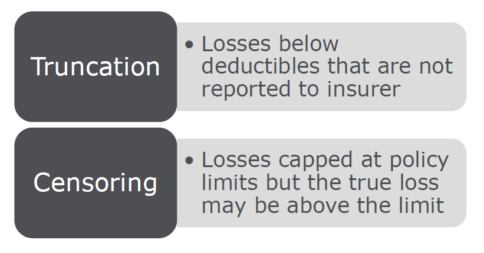
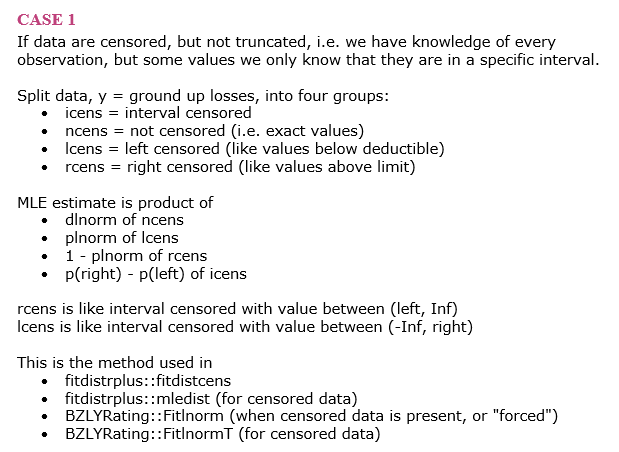

```{r setup, eval=TRUE, echo=FALSE, results='hide'}
source('../_common/common.R')
library(tidyverse)
library(ggplot2)
library(MASS)
library(actuar)
library(fitdistrplus)
```


## Sample Policies

```{r}
deductibles <- c(1e3, 5e3, 10e3)
limits <- c(100e3, 250e3, 500e3)
set.seed(0)
policy_ded <- sample(deductibles, 1e3, replace = TRUE, prob = c(5, 3, 1))
policy_lim <- sample(limits, 1e3, replace = TRUE, prob = c(5, 3, 1))
table(policy_ded, policy_lim)
```


## Real Loss Distribution

I want a loss distribution that is less than 1000 10% of the time
and over 500,000 2% of the time.


:::::::::::::: {.columns}
::: {.column}
```{r}
optim_res <- optim(
  par = c(9.0, 2.0), 
  fn = function(p) {
    (1e3 - qlnorm(0.1, p[1], p[2]))^2 + 
      (500e3 - qlnorm(0.98, p[1], p[2]))^2
  })
mu <- 9.30
sigma <- 1.86
qlnorm(c(0.1, 0.98), mu, sigma)
```
:::
::: {.column}
```{r echo=FALSE}
print(optim_res)
```
:::
::::::::::::::


## Simulate Losses

```{r fig.height=3, fig.width=7, fig.}
set.seed(-93)
ground_up <- rlnorm(1e3, mu, sigma)
```

:::::::::::::: {.columns}
::: {.column}
```{r echo=FALSE}
hist(ground_up[ground_up < 1e6], main = NULL)
```
:::
::: {.column}
```{r echo=FALSE}
hist(log(ground_up), main = NULL)
```
:::
::::::::::::::


## Losses to Beazley

```{r}
claims <- data.frame(
  policy_ded, policy_lim, ground_up, 
  beazley = pmin(policy_lim, pmax(ground_up - policy_ded, 0)))
```

:::::::::::::: {.columns}
::: {.column}
```{r echo=FALSE}
hist(claims$beazley, breaks = 20, main = NULL)
```
:::
::: {.column}
```{r echo=FALSE}
hist(log(claims$beazley + 1), breaks = 20, main = NULL)
```
:::
::::::::::::::


## Comparisons

:::::::::::::: {.columns}
::: {.column width="33%"}
```{r echo=FALSE}
hist(log(claims$ground_up + 1), breaks = 20, main = NULL)
```
:::
::: {.column width="33%"}
```{r echo=FALSE}
hist(log(claims$beazley + 1), breaks = 20, main = NULL)
```
:::
::: {.column width="33%"}
```{r echo=FALSE}
hist(log(claims$beazley[claims$beazley > 0]), breaks = 20, main = NULL)
```
:::
::::::::::::::


## Censored and Truncated




## Ignoring Limits

```{r}
fitdistrplus::fitdist(
  claims$beazley[claims$beazley > 0], 
  distr = 'lnorm', 
  method = 'mme')
qlnorm(c(0.1, 0.98), 9.98, 1.07)
plnorm(c(1000, 500e3), 9.98, 1.07)
```


## Maximum Likelihood Estimation

Basic idea:

1. n observations
2. make an assumption about the parametric form of the underlying distribution
3. what is the probability of seeing each observation given those assumptions?
4. multiply all those probabilities together
5. change parameters in #2 until #4 is maximized

What we actually do:

* #4 gets really small really fast
* take logs and sum instead
* maximize that sum


## MLE Case #1




