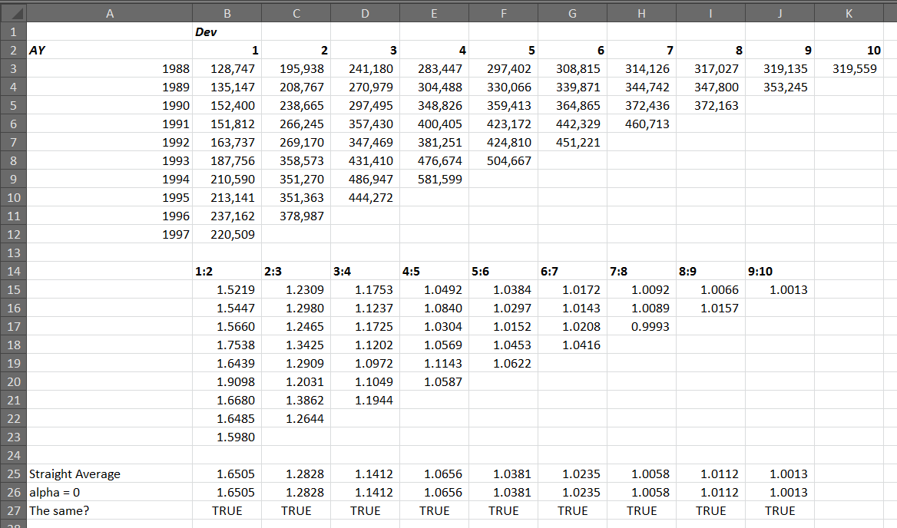
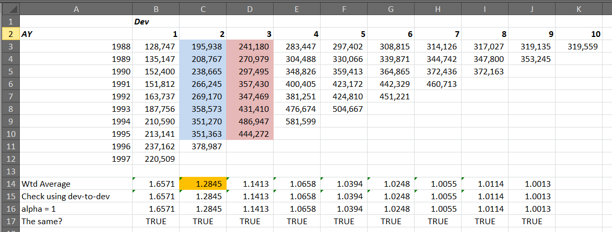
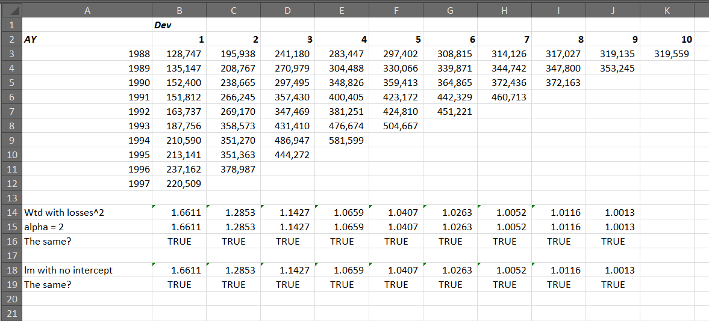
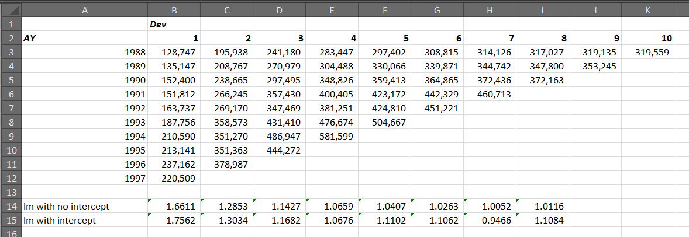

```{r include=FALSE}
source('common.R')
```


## Acknowledgments

* Original presentation adapted from content found at http://opensourcesoftware.casact.org/chain-ladder
* Thanks to Brian for his slides from 2019
* Thanks to Dan Murphy for his slides from 2018


## Package

Make sure you have the `ChainLadder` package installed.

```{r eval=FALSE}
install.packages('ChainLadder')
library(ChainLadder)
library(tidyverse)
```
```{r echo=FALSE}
library(ChainLadder)
library(tidyverse)
```


## Introduction
A package developed by Markus Gesmann, an actuary formerly at Lloyd's,
with several contributors.  From the description file:

> Various statistical methods and models which are
typically used for the estimation of outstanding claims reserves
in general insurance, including those to estimate the claims
development result as required under Solvency II.


## Load some data
Load Sch P data from http://www.casact.org/research/index.cfm?fa=loss_reserves_data
```{r}
asl17g <- read.csv('http://www.casact.org/research/reserve_data/othliab_pos.csv')
names(asl17g)
```


## Fields in asl17g

:::::::::::::: {style="font-size: 0.75em;"}

Field               | Description
------------------- | ------------------
GRCODE              | NAIC company code (including insurer groups and single insurers)
GRNAME              | NAIC company name (including insurer groups and single insurers)
AccidentYear        | Accident year(1988 to 1997)
DevelopmentYear     | Development year (1988 to 1997)
DevelopmentLag      | Development year (AY-1987 + DY-1987 - 1)
IncurLoss_h1        | Incurred losses and allocated expenses reported at year end 
CumPaidLoss_h1      | Cumulative paid losses and allocated expenses at year end 
BulkLoss_h1         | Bulk and IBNR reserves on net losses and defense and cost containment expenses reported at year end 
PostedReserve97_h1  | Posted reserves in year 1997 taken from the Underwriting and Investment Exhibit - Part 2A, including net losses unpaid and unpaid loss adjustment expenses 
EarnedPremDIR_h1    | Premiums earned at incurral year - direct and assumed 
EarnedPremCeded_h1  | Premiums earned at incurral year - ceded 
EarnedPremNet_h1    | Premiums earned at incurral year - net 
Single              | 1 indicates a single entity, 0 indicates a group insurer

::::::::::::::


## Recap

Take a moment to invesitgate the data yourself.  Some suggestions...
```{r, eval = FALSE}
# What GROUPs are here?
sort(unique(asl17g$GRNAME))
```
* How many groups are there?
* What is a unique key on the data?  How can one prove it?
* How would you calculate the total premium for ASL 17 by accident year?


## Answer: how many groups?
```{r}
length(unique(asl17g$GRNAME))

asl17g$GRNAME %>% unique %>% length

asl17g %>% 
  group_by(GRNAME) %>% 
  summarize() %>% 
  nrow
```


## Answer: unique key
```{r}
nrow(asl17g)
nrow(unique(asl17g[, c('GRCODE', 'AccidentYear', 'DevelopmentYear')]))
nrow(unique(asl17g[, c('GRCODE', 'AccidentYear', 'DevelopmentLag')]))

nrow(unique(asl17g[, c('GRCODE', 'AccidentYear')]))
nrow(unique(asl17g[, c('GRCODE', 'DevelopmentLag')]))
nrow(unique(asl17g[, c('AccidentYear', 'DevelopmentLag')]))
```


## Answer: premium by accident year?
```{r}
asl17g %>% 
  dplyr::filter(DevelopmentYear == 1997) %>% 
  group_by(AccidentYear) %>% 
  summarize(TotalPremium = sum(EarnedPremDIR_h1))
```


## Clean up the data

Aggregate and clean up the data a little.

```{r}
asl17 <- asl17g %>% 
  rename(
    AY = AccidentYear,
    DY = DevelopmentYear,
    Dev = DevelopmentLag) %>% 
  group_by(AY, DY, Dev) %>% 
  summarize(
    UltLoss = sum(IncurLoss_h1),
    PdLoss = sum(CumPaidLoss_h1),
    IBNR = sum(BulkLoss_h1),
    GPE = sum(EarnedPremDIR_h1)) %>% 
  ungroup() %>% 
  mutate(
    IncLoss = UltLoss - IBNR)
```


## `as.triangle`

* `origin` is the row names of the triangle
* `dev` is the column names of the triangle

```{r}
tri.inc <- as.triangle(
  asl17[asl17$DY <= 1997, ], 
  origin = 'AY', 
  dev = 'Dev', 
  value = 'IncLoss')

tri.pd <- as.triangle(
  asl17[asl17$DY <= 1997, ], 
  origin = 'AY', 
  dev = 'Dev', 
  value = 'PdLoss')

tri.gpe <- as.triangle(
  asl17[asl17$DY <= 1997, ], 
  origin = 'AY', 
  dev = 'Dev', 
  value = 'GPE')

tri.os <- tri.inc - tri.pd
```


## Investigate results
```{r}
tri.pd
```
Etc.


## How could you use `dplyr`?

```{r}
asl17 %>% 
  dplyr::filter(DY <= 1997) %>% 
  select(AY, Dev, PdLoss) %>% 
  tidyr::spread(key = Dev, value = PdLoss)
```


## Mack Chain Ladder

* Uses "chain ladder" methods
* Predicts ultimates and standard errors
* Several parameters to customize analysis
* Standard error method: http://www.actuaries.org/LIBRARY/ASTIN/vol29no2/361.pdf 

```{r, eval = FALSE}
MackChainLadder <- function (
  Triangle, 
  weights = 1, 
  alpha = 1, 
  est.sigma = "log-linear",    
  tail = FALSE, 
  tail.se = NULL, 
  tail.sigma = NULL, 
  mse.method = "Mack") {...}
```


## Parameters

Parameter     | Notes
------------- | --------------
Triangle      | the cumulative loss triangle
alpha         | it is the ratio used in the prediction of ultimate values, alpha = 1 (default) is the chain ladder ratio, alpha = 0 is the simple average of the development ratios, and alpha = 2 is the weighted average of the development ratios
weights       | a triangle of weights
tail          | If tail = FALSE no tail factor will be applied (default), if tail=TRUE a tail factor will be estimated via a linear extrapolation of log(chainladderratios - 1), if tail is a numeric value(>1) then this value will be used instead.
...           | see ?ChainLadder for others


## Default example
```{r}
mcl <- MackChainLadder(tri.inc)
print(mcl)
```
Try `tri.pd` and `tri.gpe` yourself.


## Diagnotic plots with `plot`

Plots six different graphs

1. Mack Chain Ladder Results
2. Chain ladder developments by origin period
3. Standardised residuals by Fitted value
4. Standardised residuals by Origin Period
5. Standardised residuals by Calendar period
6. Standardised residuals by Development period

The residual plots should be scattered with no pattern or direction for Mack's method of calculating the standard error to apply.  Patterns could be a result of a trend that should be 
investigated further. For more information see http://www.casact.org/pubs/proceed/proceed00/00245.pdf.


## 

:::::::::::::: {.columns}
::: {.column}
```{r echo=FALSE}
plot(mcl, which = 1)
```
:::
::: {.column}
```{r echo=FALSE}
plot(mcl, which = 2)
```
:::
::::::::::::::


## 

:::::::::::::: {.columns}
::: {.column}
```{r echo=FALSE}
plot(mcl, which = 3)
```
:::
::: {.column}
```{r echo=FALSE}
plot(mcl, which = 4)
```
:::
::::::::::::::


## 

:::::::::::::: {.columns}
::: {.column}
```{r echo=FALSE}
plot(mcl, which = 5)
```
:::
::: {.column}
```{r echo=FALSE}
plot(mcl, which = 6)
```
:::
::::::::::::::


## Plot a triangle
```{r out.height = "450px"}
plot(tri.inc)
```


## What's the return value?

:::::::::::::: {style="font-size: 1.0em;"}

Object                  Description
----------------------- -------------------------
`call`                  the original function call, e.g. `MackChainLadder(tri.inc, weights = w, tail = 1.1)`
`triangle`              triangle data passed in
`FullTriangle`          forecasted full triangle
`weights`               triangle of weights
`Models`                linear regression models for each development period
`f`                     chain-ladder age-to-age factors
`tail`                  tail factor used. If tail was set to TRUE the output will include the linear model used to estimate the tail factor
*error-related fields*  *see Mack's original paper*

::::::::::::::


## Method `alpha = 0`

```{r}
# Simple average of the dev ratios
mcl0 <- MackChainLadder(tri.inc, alpha = 0)
```




## Method `alpha = 1`

```{r}
# Chain Ladder ratio ("loss wtd average")
mcl1 <- MackChainLadder(tri.inc, alpha = 1)
```




## Method `alpha = 2`

```{r}
# Same as `lm` with no intercept
mcl2 <- MackChainLadder(tri.inc, alpha = 2)
```




## Using `lm`

```{r}
x <- tri.inc[, 1:9]
y <- tri.inc[, 2:10]
x[is.na(x)] <- 0
y[is.na(y)] <- 0

beta0 <- numeric()
beta1 <- numeric()
for (i in 1:8) {
  beta0[i] <- lm(
    y[1:(10-i), i] ~ 0 + x[1:(10-i), i])$coefficient[1]
  
  beta1[i] <- lm(
    y[1:(10-i), i] ~ 1 + x[1:(10-i), i])$coefficient[2]
}

print(beta0)
print(beta1)
```


## Compare with Excel




## Different Tails
```{r}
MackChainLadder(tri.inc)$tail
MackChainLadder(tri.inc, tail = 1.1)$tail
MackChainLadder(tri.inc, tail = TRUE)$tail
```


## Use weights to remove points from development
```{r}
w <- matrix(1, nrow = 10, ncol = 10)
w[3, 4] <- 0

MackChainLadder(tri.inc)$f
MackChainLadder(tri.inc, weights = w)$f
```


## Munich Chain Ladder
* Uses paid and incurred triangles to predict ultimates
* For details see http://www.variancejournal.org/issues/02-02/266.pdf

```{r, eval=FALSE}
MunichChainLadder <- function(
  Paid, 
  Incurred, 
  est.sigmaP = "log-linear", 
  est.sigmaI = "log-linear", 
  tailP = FALSE, 
  tailI = FALSE
) {...}
```


## Munich Chain Ladder example
```{r}
munich <- MunichChainLadder(tri.pd, tri.inc)
print(munich)
```


## `plot`

```{r out.height = "450px"}
plot(munich)
```


## Other methods

* Dave Clark's methods
    + `ClarkLDF`
    + `ClarkCapeCod`
* Other stochastic methods include ...
    + `BootChainLadder`: Bootstrapping
    + `tweedieReserve`: glm including one-year risk horizon (Solvency II)
    + `glmReserve`
    + `MultiChainLadder` and `MultiChainLadder2`
    


## Questions?


